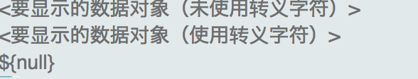

### JSTL 核心标签库

 
| 分类     | 标签 | 
| :------- | ----: | 
| 表达式控制 | out,set,remove,catch |  
| 流程控制    | if,choose,when,otherwise   |  
| 循环     | forEach,forTokens    |  
| URL操作     | import,url,redirect    |  

使用之前一定要在pom.xml里面添加

```xml
  <dependency>
            <groupId>javax.servlet</groupId>
            <artifactId>jstl</artifactId>
            <version>1.2</version>
            <scope>runtime</scope>
        </dependency>
```

然后引入

```html
<%@taglib prefix="c" uri="http://java.sun.com/jsp/jstl/core" %>  
``` 

#### < c:out>

```html
<body>  
  <c:out value="<要显示的数据对象（未使用转义字符）>" escapeXml="true" default="默认值"></c:out><br/>  
  <c:out value="<要显示的数据对象（使用转义字符）>" escapeXml="false" default="默认值"></c:out><br/>  
  <c:out value="${null}" escapeXml="false">使用的表达式结果为null，则输出该默认值</c:out><br/>  
</body>  
```
那么显示的网页为


#### < c:set>